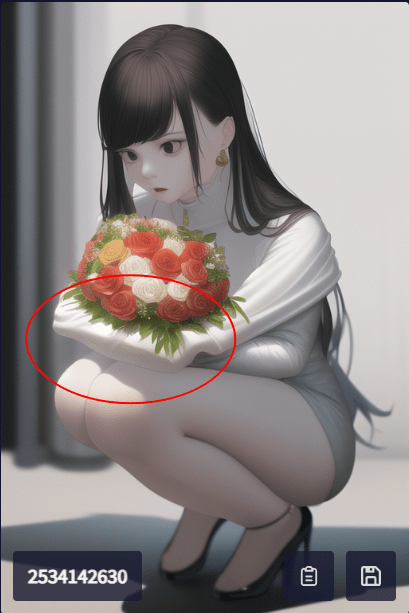
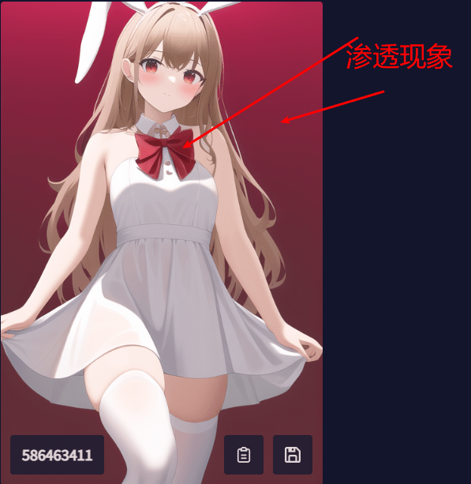

# 魔导绪论

[AI 魔咒生成器](https://magic-tag.netlify.app/#/), 使用由 B 站 UP 主 [十二今天也很可爱](https://www.bilibili.com/video/BV1m84y1B7Ny/?p=1&t=285&vd_source=a2ecd44ec8a0a62c70f8b98747f4aa56) 提供的 4 万个 tag 并提供中文检索，方便魔法师们直接使用。

中文翻译为谷歌机翻，可能比较水，就当英文翻译题好了。

默认为青少年模式，但是违禁词过滤估计还会有漏网之鱼，请多多提 issue；模式则可以通过设置面板调整 (\*^\_^\*)。

## TODO

-   [x] 自主添加 tag
-   [x] 分享功能
-   [x] 设置面板
-   [x] 青少年模式
-   [x] csv 预先压缩 Netlify 设置压缩即可
-   [ ] tag 收藏栏

## 魔导绪论指南

### 明白魔导绪论的原理

1. 魔导绪论的文件都是静态文件，没有 api。
2. 魔导绪论有一个庞大的标签列表，在 public/tags.csv
3. 魔导绪论在此基础上实现了 tags 的查询操作，将来也会有存储操作，分享操作（MayBe One Day）
4. 魔导绪论需要一个支持 tags 的 AI 图片生成工具，这个就自行查找吧。

### 使用魔导绪论绘制你想要的图片

> 使用魔导绪论并按照下面的流程，简单高效生成美图！
> 下面的所有英文都是复制的，魔导绪论相当于高效的翻译工具

1. 使用基础的大范围的描述质量的标签，如 masterpiece，highly detailed，best quality 等标签
2. 首先你需要想象你需要绘制的图形，AI 也要知道具体的描述和足够数量的训练支持才能够绘制精美的图像
3. 选择你的背景，可以为 海洋，城堡，天空等，直接在魔导绪论输入你的词，然后选中即可
    1. 背景是一类较为综合的概括，配合前面的高质量描述，就可以得到很好看的风景图了 (highly detailed,best quality,ocean)
       
    2. 当然你可以添加其他的元素进行进一步优化。
4. 如果你是绘制二次元人物肖像，那么可以思考人物的形象。如果无从下手，那么我们可以从下面的路径进行思考。
    1. 全身 or 半身？full body | upper body
    2. 头发如何？试着搜索 绿色的头发 | 短发 | 直发
    3. 五官如何？蓝眼睛 | 眼镜 | open mouth | 脸红
    4. 穿什么衣服？洛丽塔 | maid
        1. 如果详细到上衣，裤子的话，建议详细查找相应的物品
    5. 指定鞋子，凉鞋 | 赤脚

> 现在，我们就有了较为合理的图像画面了，但是细节部分仍然需要进行调整。
> highly detailed,best quality,ocean,green hair,short hair,straight hair,blue eyes,glasses,full body,open mouth,blush,lolita fashion,sandals,barefoot,solo


5. 比如说，我想要的单人，那么我就加个 solo，想要跳舞，那么就加个 dancing。如果觉得海滩穿着洛丽塔不合适，那就换成泳装，朝着你的想象的方向去绘制就对了。

> highly detailed,best quality,ocean,green hair,short hair,straight hair,blue eyes,glasses,full body,open mouth,blush,sandals,barefoot,solo,swimsuit


### 一些不推荐的操作

1. 减少类似部位干两件事情，比如说描述手虽然可以左右手不同样，但是 AI 很难分清左右，它极大概率会将两种不同姿势的动作合在一起，这样可能会导致多手。

> 标签翻译成中文了：独奏，精细，高质量，拿着食物，拿着花束，蹲着
> 

2. 多重因素影响。通用型的标签具有非常明显的描述性，但是配合其他的标签会导致混合错误。比如红色的衣服可能会导致鞋子，头发等被染色。这个是由于画师在一幅图像上一般颜色统一，这个被标签之后，AI 认为其他的同色部分也是特征，也就加入了。最好的方法是指定颜色，缩小并稳定色彩范围。

> solo,highly detailed,best quality,red bow,black thighhighs,white dress,bunny background

> 

1. 劣质标签干扰。劣质标签导致的原因是低概率的标签没有够的训练集，导致 AI 并不知道它的全貌，所以会施展融合大法去。

> solo, 种子，蚊子，兔子背景

> 

# 开发者相关

## 打包流程

```sh
pnpm i
pnpm dev # 开发者模式查看
pnpm build # 打包版本
node ./scripts/swearFilter.mjs # 对敏感词进行标记
```
